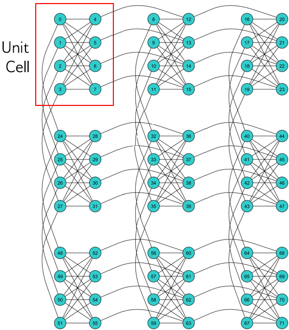

.. _Testing:

============================================================
Architecture: Chimera
============================================================

Understanding the layout of ...

Chimera Graph
================

The Chimera architecture comprises 

  A :math:`3 {\rm x} 3`  Chimera graph, denoted C3. Qubits are arranged in 9 unit cells.

